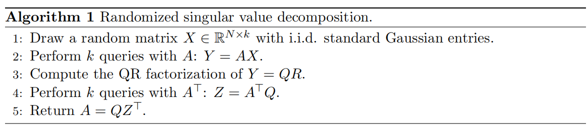

# From numerical linear algebra to operator learning

算子学习与从矩阵-向量乘积中恢复结构化矩阵之间存在紧密联系。假设某人试图使用单层神经算子来近似线性偏微分方程的解算子，且不使用非线性激活函数。那么，在使用求积规则对积分算子进行离散化后，它可以写成矩阵-向量乘积的形式，其中积分核$K:\Omega \times \Omega \leftarrow \mathbb{R}$由矩阵$A \in \mathbb{R}^{N \times N}$近似表示。此外，该矩阵的结构源自格林函数的性质。矩阵的底层结构——无论是低秩、循环、带状还是分层低秩——在决定恢复过程的效率和方法上起着关键作用。

考虑一个具有已知结构（如k阶秩或带状结构）的未知矩阵$A \in \mathbb{R}^{n \times n}$。我们假设矩阵A是一个不可见的黑箱，但可以通过矩阵-向量乘积（即映射 $x^{T} \rightarrow Ax$ 和 $x^{T} \rightarrow A^{T}x$）来探测其信息，其中 $A^{T}$ 表示矩阵A的转置。矩阵恢复问题的核心在于：通过尽可能少的 $x^{T} \rightarrow Ax$和$x^{T} \rightarrow A^{T}x$查询来逼近矩阵A。对于所有N列矩阵，最多需要N次矩阵-向量乘积查询即可完成推导——例如当1≤j≤N时，$Ae_j$会返回第$j$列，其中$e_j$表示第$j$个标准基向量。然而，若矩阵$A$具有特定结构（如低秩、循环、带状或分层低秩），通常只需更少的查询次数即可完成恢复。本节将阐述如何利用矩阵-向量乘积高效恢复结构化矩阵。我们倾向于使用**高斯随机向量**进行矩阵恢复，因为这些向量的无限维对应物是从高斯过程抽取的随机函数，而**高斯过程正是算子学习中训练输入数据的常用选择**。

## 低秩矩阵恢复

假设$A \in \mathbb{R}^{N \times N}$表示秩为$k$的矩阵，则它可以被表示成$C \in \mathbb{R}^{N \times k}$和$R \in \mathbb{R}^{k \times N}$的乘积，即$$A=CR.$$研究证明，至少需要$2k$次查询才能捕获$k$维行空间和列空间并推导出矩阵A。

随机奇异值分解（SVD）是一种随机的矩阵分解方法，它能以$1 \over {2k}$的概率从随机高斯向量的矩阵向量乘积中恢复出秩$k$的矩阵，随机SVD算法可如下表示：

在低秩矩阵恢复中，随机算法至关重要，它能有效防止输入向量落入$A$的$N−k$维零空间。因此，若使用固定输入向量的确定性算法，就无法恢复任何低秩矩阵。针对秩$k$矩阵恢复问题，算法1能以100%的概率成功恢复矩阵$A$。为确保数值稳定性，通常采用较小的过采样参数$p \geq 1$（例如$p = 5$）。这意味着$X \in \mathbb{R}^{N \times(k+p)}$，从而避免随机高斯向量与A的零空间高度重合的可能性。

低秩矩阵恢复是深度神经网络DeepONet最直观的应用场景之一。该网络的核心特性在于利用主网络对分支网络生成的基函数集进行解算子作用。虽然在低秩矩阵恢复中，我们通常会随机抽取$X$的列向量作为输入，但深度神经网络DeepONet的训练正是基于这些基函数。与深度神经网络DeepONet类似，低秩矩阵恢复构建的精确逼近函数作用于这些向量。通过深度神经网络DeepONet，许多函数空间之间的算子往往能以高精度表示，这与线性偏微分方程解算子的核函数具有**代数快速衰减奇异值的特性**如出一辙。

注1：  
    1. Singular Values（奇异值） ：奇异值是矩阵分解中的核心概念，来源于奇异值分解（SVD）。它们是非负实数，表示矩阵在不同方向上的拉伸或压缩程度。奇异值越大，对应的特征方向对矩阵的贡献越大。 
    2. SVD（Singular Value Decomposition，奇异值分解） ：SVD是一种重要的矩阵分解方法，将一个矩阵分解为三个部分：左奇异向量矩阵、奇异值对角矩阵和右奇异向量矩阵。SVD广泛应用于数据降维、图像处理和推荐系统等领域。 
    3. Fast Decaying（快速衰减） ：快速衰减描述了某种数值序列迅速减小的趋势。在奇异值的上下文中，快速衰减意味着大部分能量集中在前几个奇异值上，后续的奇异值对矩阵的贡献微乎其微。 
    4. Dimensionality Reduction（降维） ：降维是机器学习和数据分析中的一种技术，旨在减少数据的特征数量，同时尽可能保留重要信息。快速衰减的奇异值使得降维成为可能，因为可以通过截断小奇异值来近似原始矩阵。

## 循环矩阵恢复

FNO的结构与循环矩阵恢复密切相关。考虑一个 $N \times N$ 的循环矩阵 $C_c$，它由一个向量 $c \in \mathbb{R}^N$ 参数化，形式如下：

$$
C_c = \begin{bmatrix} 
c_0 & c_{N-1} & \cdots & c_2 & c_1 \\
c_1 & c_0 & c_{N-1} & \ddots & c_2 \\
\vdots & c_1 & c_0 & \ddots & \vdots \\
c_{N-2} & \ddots & \ddots & \ddots & c_{N-1} \\
c_{N-1} & c_{N-2} & \cdots & c_1 & c_0 
\end{bmatrix} .
$$

为了利用一个随机高斯向量 $g$ 来恢复 $C_c$，我们需要回顾一点：$C_c$ 可以被解释为傅里叶基下的乘法算子。根据乘法的结合律，我们有

$$C_c g = C_g c .$$

如果我们执行矩阵-向量乘积查询 $y = C_c g$，我们可以通过求解线性系统 $C_g c = y$ 来找到向量 $c$。由于 $c$ 完全定义了 $C_c$，我们也就恢复了该循环矩阵。此外，线性系统 $C_g c = y$ 可以使用快速傅里叶变换 (FFT) 在 $\mathcal{O}(N \log N)$ 次运算内高效求解。循环矩阵的一个便捷特性是，给定一个新的向量 $x \in \mathbb{R}^N$，我们可以使用 FFT 在 $\mathcal{O}(N \log N)$ 次运算内计算 $C_c x$。

循环矩阵恢复激发了傅里叶神经算子的应用动机。因此，FNOs利用快速傅里叶变换高效地参数化解算子的核函数。同理，循环矩阵可通过离散傅里叶变换矩阵进行对角化。无限维情形下的循环矩阵对应解算子具有周期性且平移不变的核，这类解算子完全满足 FNO 假设。由于结构特性，FNOs的计算速度极快，因此在参数优化中应用广泛，且与降阶模型的基准测试表现优异。

## 分层低秩矩阵恢复

一个 $N \times N$ 的秩-$k$ **分层非对角低秩 (HODLR) 矩阵**，记为 $H_{N,k}$，是一种经常出现在与椭圆和抛物线偏微分方程相关的离散化解算子背景下的结构。为了理解其递归结构，我们假设 $N$ 是 2 的幂，并在图 3(a) 中展示该结构。

由于恢复一个秩-$k$ 矩阵需要 $2k$ 次矩阵-向量乘积查询（见第 2.1 节），推导 $H_{N,k}$ 的一种朴素方法是对每个子矩阵使用 $2k$ 次独立查询。然而，可以证明 $H_{N,k}$ 的某些子矩阵可以使用相同的查询并发地恢复。我们使用一种图着色方法来确定哪些子矩阵可以并发恢复。这一次，我们考虑这样一个图：其中每个顶点是 $H_{N,k}$ 的一个低秩子矩阵，如果两个顶点对应的低秩子矩阵占据相同的列（如图 3(b) 所示），则连接这两个顶点。在每一层颜色相同的低秩子矩阵仅需 $2k$ 次查询即可并发恢复。因此，可以证明一个 $N \times N$ 分层秩-$k$ 矩阵可以在少于 $10k \lceil \log_2(N) \rceil$ 次矩阵-向量乘积中被恢复。图 3(b) 中的精确着色也可用于推导一种特定的分层矩阵恢复算法，称为**剥离 (peeling)** 。这些剥离算法最近已被推广到无限维设置。

HODLR 恢复可以被视为**多极图神经算子 (MGNO)**的最简单版本，因为两者都强调在多尺度上捕获算子的重要性。MGNO 基于分层图，具有不同尺度或层级的相互作用。通过结合局部（近场）和全局（远场）相互作用，MGNO 可以有效地学习复杂的模式。由于其多尺度特性，MGNO 通常非常擅长表示解算子。其代价是最终的神经算子在评估时计算成本可能很高，而且其结构实现起来很复杂。